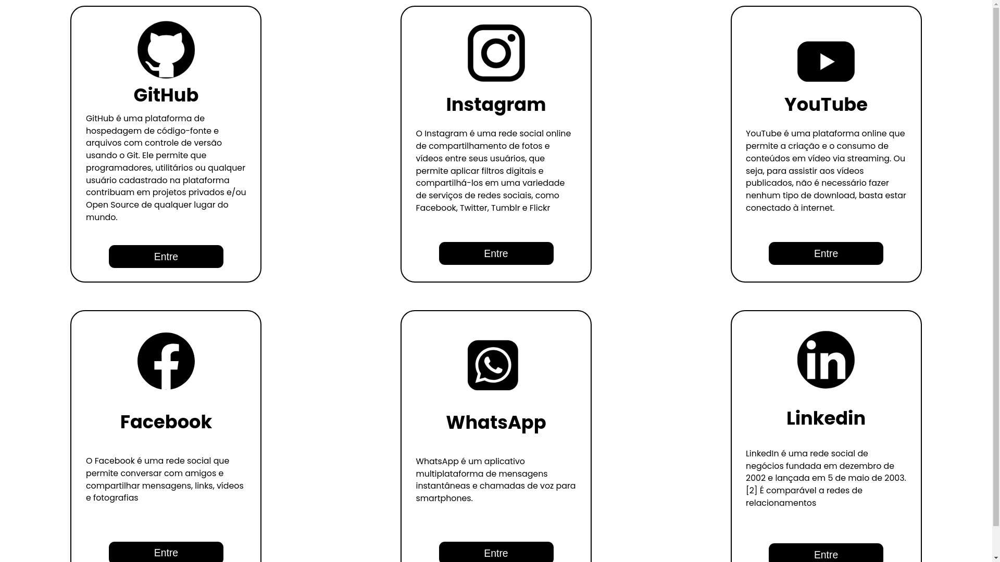

## CARDS

### Sobre o Projeto
Este projeto foi desenvolvido por mim há três anos e consiste em uma coleção de cards informativos sobre diversas redes sociais e plataformas online. Nele, incluí algumas tentativas de recriar o design inicial de cada site, embora alguns estejam inacabados. Destaco, no entanto, que consegui concluir com sucesso os clones das páginas iniciais do Instagram e Facebook, dos quais estou particularmente satisfeito com os resultados.

### Redes Sociais e Plataformas Incluídas
- Instagram
- Facebook
- Github
- Youtube
- Whatsapp
- Linkedin


### Tecnologias Usadas
- HTML
- CSS

### Screenshots
| Página Inicial no desktop |
|  | 


### Como Visualizar os Cards
Para visualizar os cards, basta clonar este repositório e abrir o arquivo correspondente à plataforma desejada. Por exemplo:

```bash
git clone https://github.com/seu-usuario/seu-repositorio.git
cd seu-repositorio
```
E após isso abrir o arquivos index.html no navegador para visualizar o contéudo.